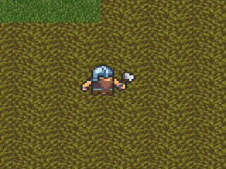
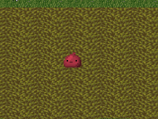
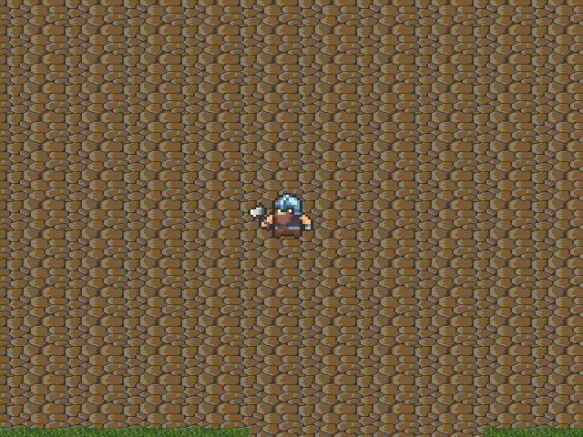
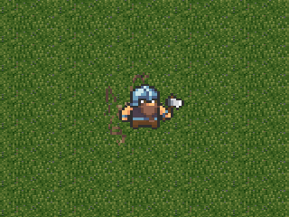
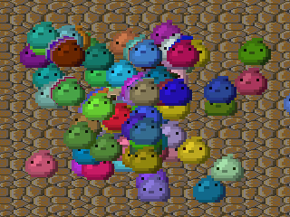

# **AirGame**

<par>
This is a project for LPT course of DMM UrFU.

In except of an external library to work with Json, 
 all code is written by us.

### We thank people who helps us with:

#### graphics:

* Michele Bucelli *@Buch* **GUI**
* Callum *@calciumtrice* **Textures**
* [Zabin](http://duskrpg.blogspot.com/) **Texures**
* [DavitMasia](https://twitter.com/DavitMasia) **Effects**
* [ashishlko11](https://twitter.com/ashishlko11) **Effects**
* [Elthen's Pixel Art Shop](https://elthen.itch.io/)  **Effects**

### Some Gameplay:

* attack

* throw fireball to kill bad guys

* blow it in

* make money

* enjoy slimes

</par>

